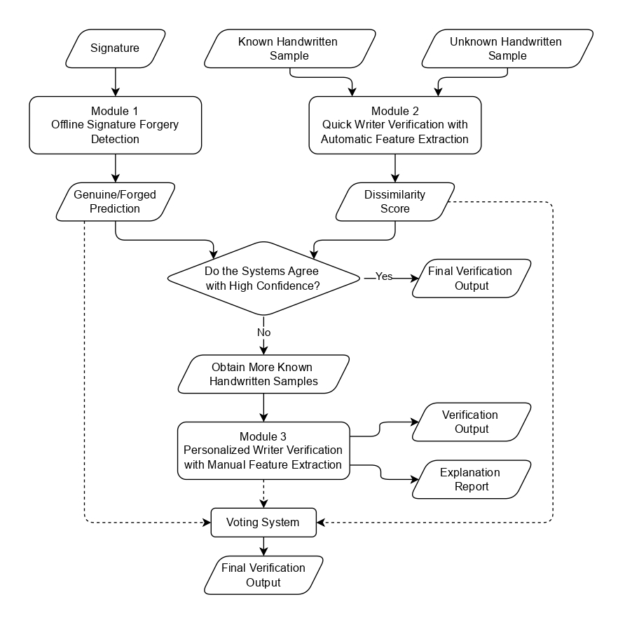

# ✍️ Exam Candidate Verification Through Handwritten Artifacts

This repository contains the final year research project demonstration titled **_Exam Candidate Verification Through Handwritten Artifacts_** by Team **Hikari Research** (Batch 20), completed as part of the **BSc. (Hons) in Information Technology and Management** at the **Faculty of Information Technology, University of Moratuwa, Sri Lanka**.

Biometrics identify individuals using physical or behavioral traits. While physiological biometrics like fingerprints are common, handwriting remains a reliable behavioral biometric used in legal and educational settings. Questioned Document Examination (QDE) helps verify document authorship using handwriting. While physiological biometrics like fingerprints are widely used, handwriting remains crucial in education and assessments due to its resistance to forgery over long texts. However, manual handwriting verification is slow and expert-dependent, making it impractical in large-scale scenarios like exam fraud detection. Recent machine learning advancements offer a scalable solution, but lack of transparency limits trust in automated decisions. This project addresses that by integrating explainable handwriting verification, enabling users to understand and trust the system’s predictions.

## 🧩 Project Modules

Our solution is divided into three major modules:

#### 1. **Signature Forgery Detection using Vision and Text Embeddings**

This module detects offline signature forgeries using CLIP, without requiring prior samples from the individual. It addresses challenges like intra-personal variations common in exam settings. Instead of comparing signatures directly, the model uses visual–textual associations to assess authenticity.

#### 2. **Quick Handwriting Verification with Automatic Feature Extraction**

This module verifies handwriting using automatically extracted features from compact texture representations. It supports two verification modes:

- Standard Mode: Uses one sample per writer.
- Two-Speed Mode: Uses both normal and fast handwriting samples to handle intra-writer variability.

This approach is fast and accurate, though less interpretable than manual methods.

#### 3. **Personalized Handwriting Verification with Manual Feature Extraction**

This writer-dependent module uses manually extracted features to enhance explainability. It combines:

- Global traits (e.g., pressure, curvature)
- Local features from frequently used letters (like e)

It also integrates SHAP-based explanations to provide feature-level interpretability, helping reviewers understand which handwriting traits influenced each decision.

## 📐 High Level Architecture of the Overall System

<p align='center'>
  
</p>

The system accepts both signature and handwriting samples. Initially, a rapid assessment is performed using the signature forgery detection module (Module 1) and the quick handwriting verification module (Module 2), both of which aim to provide a preliminary decision with high efficiency.

If the predictions from these independent modules are in agreement and demonstrate high confidence, a final verification decision is rendered. In scenarios where confidence is insufficient or disagreement occurs, the system moves to a more thorough verification process using personalized writer verification module (Module 3). This involves acquiring additional handwriting samples and leveraging a personalized verification module that uses interpretable, manually engineered features.

To ensure reliability and transparency, outputs from all modules are integrated through a voting mechanism, which consolidates the predictions into a final decision and to provide explanations for the final decision as well.

## 📊 Overall System Evaluation

The overall system gives the final verdict based on a voting system between the two modules. The system was tested on two modes.
- Using the standard sample comparison mode of module 2
- Using the two-speed sample comparison mode of module 2

The system was tested on 15 writers from the private dataset, producing 450 comparisons in standard mode and 364 in two-speed mode, representing the maximum permutations. Module 3 used a leave-one-out strategy, training on all samples of a writer except the test sample; in two-speed mode, reconstruction errors from both test samples were averaged. Module 1 included 10 genuine and 10 forged signatures per writer; for different-writer comparisons, a cartesian product with forged signatures was used, and for same-writer comparisons, genuine signatures were used yielding 4,500 comparisons in standard mode and 3,640 in two-speed mode.

The overall results with all three modules are shown in Table 1. Here, it is not considered whether the first two modules agree or disagree with each other, and proceed to module 3 only when needed. The results when taking this into consideration is shown in Table 2. The Table 3 shows the individual performance on the two writer verification systems (Module 1 and 2) on each scenario on the same test set.
 
**Table 1.** Overall system metrics with all three modules
| Mode | Accuracy | Precision | Recall | F1 | FRR | FAR |
|------|----------|-----------|--------|----|-----|-----|
| Standard Mode | 91.8% | 91.9% | 91.7% | 91.8% | 8.3% | 8.0% |
| Two-speed Mode | 96.0% | 96.8% | 95.2% | 96.0% | 4.8% | 3.2% |


**Table 2.** Staged verification system performance. Here Module 3 is only used to break ties
| Mode | Scenario | Sample Count | Correct Predictions | Accuracy | Sample Ratio |
|------|----------|--------------|---------------------|----------|--------------|
| Standard Mode | Module 1 and 2 agree | 3039 | 2803 | 92.2% | 67.5% |
| Standard Mode | All 3 modules used | 1461 | 1330 | 91.0% | 32.5% |
| Standard Mode | Overall | 4500 | 4133 | 91.8% | 100% |
| Two-speed Mode | Module 1 and 2 agree | 2498 | 2471 | 94.5% | 68.6% |
| Two-speed Mode | All 3 modules used | 1142 | 1024 | 89.7% | 31.4% |
| Two-speed Mode | Overall | 3640 | 3495 | 93.0% | 100% |

**Table 3.** Module 2 and 3 metrics on the same test set
| Mode | Module | Accuracy | Precision | Recall | F1 | FRR | FAR |
|------|--------|----------|-----------|--------|----|-----|-----|
| Standard Mode | Module 2 | 86.9% | 89.2% | 84.0% | 86.5% | 16.0% | 10.2% |
| Standard Mode | Module 3 | 91.1% | 93.0% | 88.9% | 90.9% | 11.1% | 6.7% |
| Two-speed Mode | Module 2 | 95.3% | 98.8% | 91.8% | 95.2% | 8.2% | 1.1% |
| Two-speed Mode | Module 3 | 90.4% | 90.2% | 90.7% | 90.4% | 9.3% | 9.9% |

## 🎥 Demonstration

[](https://www.youtube.com/watch?v=rQLoM4VjMiI)

## 🛠️ Installation and Setup

### Backend Setup

Navigate to the `backend` directory and run the following command to set up the environment:

```bash
pip install -r requirements.txt
```

Create a `.env` file in the `backend` directory with the following content:

```plaintext
OPENAI_API_KEY=<YOUR_OPENAI_API_KEY>
EXP_ENABLED=true
GEN_EXPLANATION=true
```

### Frontend Setup

Navigate to the `frontend` directory.

Create a `.env.local` file in the `frontend` directory with the following content:

```plaintext
NEXT_PUBLIC_API=http://localhost:8000/api/v1/
NEXT_PUBLIC_CONFIDENCE_THRESHOLD=0.6
```

Then run the following commands to install dependencies and build the frontend application:

```bash
npm install
npm run build
```

### Running the Application

To start the backend server, navigate to the `backend` directory and run:

```bash
python run.py
```
This will start the backend server on port `8000`.


Then navigate to the `frontend` directory and start the frontend server with:

```bash
npm start
```

The frontend will be accessible at `http://localhost:3000`.
